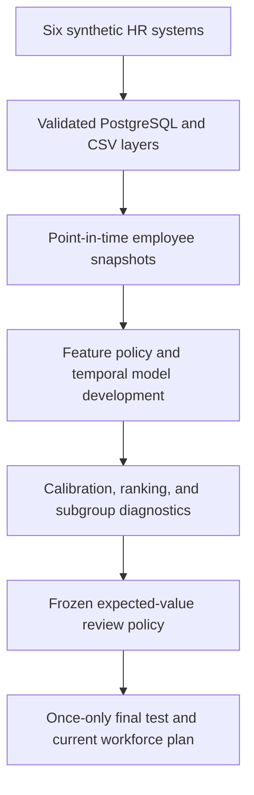

# Workforce Intelligence and Retention Decision Platform

[](https://github.com/xu1358/workforce-intelligence-platform/actions/workflows/python-quality.yml)

An end-to-end people-analytics portfolio project that converts six fragmented
synthetic HR systems into a leakage-aware retention model, a budget-constrained
human-review policy, and a current manufacturing workforce-stability plan.

> **Synthetic-data and responsible-use notice:** every employee, candidate,
> outcome, salary, and business result in this repository is fictional. The
> project demonstrates analytics engineering and decision-support methods. It
> does not describe a real employer, estimate a real intervention effect, or
> authorize automated employment action.

## Start Here

For a concise review, use these entry points:

1. [Read the four-notebook portfolio](notebooks/README.md).
2. [Open the Streamlit dashboard locally](#run-the-dashboard).
3. [Review the analytical design](#analytical-design).
4. [Inspect the evidence behind the headline claims](docs/readme_evidence_map.md).
5. [Run the automated quality checks](#fast-local-validation).
6. [Review the isolated IBM benchmark](#external-methodological-benchmark).
7. [Review retention over employee tenure](#employee-survival-extension).
8. [Review salary allocation in the final policy](#allocation-equity-audit).

## Business Decision

The project is organized around one operational question:

> Given a limited intervention budget, which active, model-eligible employees
> should be routed for supportive human review, and what workforce-stability
> and financial value might that plan create under explicit assumptions?

The answer is not a generic probability threshold. The final policy:

- uses a calibrated Logistic Regression model;
- estimates value under transparent replacement-cost, intervention-cost, and
  effectiveness scenarios;
- limits the review population to 700 employees and $1.75 million;
- is frozen before the once-only out-of-time test is opened;
- requires human review; and
- prohibits automatic employment action.

## Headline Results

All figures below are deterministic outputs from the synthetic Version 2
pipeline.

| Area | Validated result | Interpretation |
| --- | ---: | --- |
| Current workforce | 7,409 active employees | Current synthetic population as of 2026-06-30 |
| Current scoring coverage | 7,305 model-eligible employees | Individual contributors and team managers only |
| Final out-of-time model | PR-AUC 0.1710; ROC-AUC 0.6061; Brier 0.1048 | Modest but useful ranking on the reserved 2025 snapshot |
| Top-decile ranking | 19.85% precision; 1.64 lift | Compared with a 12.09% final-test attrition rate |
| Frozen intervention plan | 700 human reviews; $1.75M budget | Capacity- and budget-constrained expected-value policy |
| Final-test policy | 17.06% capture; $2.03M outcome-aligned net value | Once-only evaluation with no post-test retuning |
| Current planning projection | 35.0 expected prevented departures; $2.40M expected net value | Scenario projection, not an observed outcome |
| Policy allocation equity | Selected mean salary $125,670 versus $95,722 eligible; highest pay quintile selected 25.83× as often as lowest | Salary-based value optimization is not equity-neutral |
| Manufacturing plan | 229.7 expected departures; 221.3 residual backfills | Probability-weighted 12-month planning estimates |
| Explanation stability | Minimum rank correlation 0.8857; minimum top-10 overlap 0.6667 | Aggregate model drivers remain broadly stable across grouped refits |
| Survival extension | 89.53% retained at 12 months; 57.51% at 60 months | Censoring-aware synthetic retention estimates |

The final-test model is better than random ranking, but it is not strong enough
to justify automatic individual decisions. Its appropriate role is to support
structured review, scenario analysis, and workforce-capacity planning.

## Why This Project Is More Than a Classifier

The repository demonstrates a complete analytical decision system:

- reproducible synthetic data generation across six fictional source systems;
- a normalized 12-table PostgreSQL schema and validated ingestion pipeline;
- historical, point-in-time feature construction;
- three non-overlapping 12-month prediction windows;
- explicit feature-redundancy and multicollinearity controls;
- temporal model development with a reserved final test;
- employee-grouped robustness checks and bootstrap uncertainty;
- exact aggregate linear-SHAP explanations and grouped-refit stability checks;
- Kaplan–Meier and Cox time-to-exit diagnostics with right-censoring;
- sigmoid probability calibration;
- ranking, subgroup, fairness, and sensitivity analysis;
- an explicit retention cost model;
- a frozen budget-constrained intervention policy;
- a post-policy salary-allocation equity audit;
- a current-state Streamlit dashboard;
- an isolated external-dataset methodological benchmark; and
- automated tests, Ruff checks, and GitHub Actions.

## Analytical Design



### Temporal evaluation

Each row represents an employee who was active on a snapshot date. Features
use only information available on or before that date, and the target records
attrition during the following 12 months.

| Role | Snapshot | Prediction window ends | Eligible rows | Positive cases | Use |
| --- | --- | --- | ---: | ---: | --- |
| Train | 2023-06-30 | 2024-06-30 | 4,206 | 414 | Fit candidate models |
| Validation | 2024-06-30 | 2025-06-30 | 5,521 | 586 | Select model, calibration, and policy |
| Final test | 2025-06-30 | 2026-06-30 | 6,641 | 803 | Once-only out-of-time evaluation |
| Current scoring | 2026-06-30 | Future outcomes unknown | 7,305 | Unknown | Human-review and capacity planning |

The final-test target is masked during development. Repeated employees are
kept together in grouped robustness folds, and current scores are never
presented as new performance evidence.

### Leakage controls

- Termination status, termination date, and future event information are
  excluded from model features.
- Compensation, performance, training, transfer, promotion, manager-change,
  and leave records are cut off at each snapshot.
- Historical locations are reconstructed from hire and transfer events.
- Train, validation, and final-test prediction windows do not overlap.
- Feature selection uses only the 2023 and 2024 development snapshots.
- The intervention policy is selected and hashed before final-test access.

See the [temporal dataset design](docs/temporal_dataset_design.md),
[feature policy](docs/feature_interpretation.md), and
[validation strategy](docs/model_validation_strategy.md).

## Model Development and Final Evaluation

### Candidate comparison

Logistic Regression, Gradient Boosting, and Random Forest receive the same 21
raw features. PR-AUC is the primary ranking metric because attrition is the
minority outcome.

| Model | 2024 validation PR-AUC | ROC-AUC | Mean grouped PR-AUC |
| --- | ---: | ---: | ---: |
| Logistic Regression | 0.1638 | 0.6211 | 0.1665 |
| Gradient Boosting | 0.1615 | 0.6293 | 0.1664 |
| Random Forest | 0.1523 | 0.6233 | 0.1554 |

Logistic Regression is selected because it has the highest observed
validation PR-AUC, competitive grouped robustness, and the lowest complexity.
Paired bootstrap intervals do not establish that it is definitively better
than Gradient Boosting, so the decision deliberately favors simplicity rather
than claiming a conclusive winner.

### Probability calibration

The original Logistic Regression scores substantially overpredict attrition.
Sigmoid calibration reduces validation Brier score from 0.2403 to 0.0932 while
preserving ranking performance. The dashboard therefore labels the calibrated
score **Estimated 12-month attrition probability**.

### Reserved final test

After all development choices are frozen, the selected model is fitted on the
2023 and 2024 histories and evaluated once on the 2025 snapshot:

| Metric | Final-test result |
| --- | ---: |
| Rows | 6,641 |
| Attrition cases | 803 |
| Attrition rate | 12.09% |
| PR-AUC | 0.1710 |
| ROC-AUC | 0.6061 |
| Brier score | 0.1048 |
| Top-decile precision | 19.85% |
| Top-decile capture | 16.44% |
| Top-decile lift | 1.64 |

Read the full [model comparison](docs/model_comparison_v2.md),
[calibration analysis](docs/calibration_analysis.md), and
[ranking analysis](docs/ranking_analysis.md).

### Model explanations and stability

Checkpoint 54 explains the current Logistic Regression on its native log-odds
scale. Exact linear SHAP values are grouped from 35 encoded columns into the
21 raw policy features and saved only as aggregate evidence.

The leading current-population drivers are `salary_position_percent`,
`tenure_years`, and `performance_rating`. Five employee-grouped diagnostic
refits produce a minimum pairwise importance-rank correlation of 0.8857, a
median correlation of 0.9299, and a minimum top-10 Jaccard overlap of 0.6667.
Every globally top-10 feature keeps the same highest-probability-quartile
direction in all five refits.

These are model-score associations, not causal effects. Contributions explain
base-model log-odds rather than calibrated probability percentage points. No
employee-level explanation is saved, the once-only final test is not reopened,
and the frozen top-700 policy is not changed.

Read the full
[explanation and stability methodology](docs/model_explanations_and_stability.md)
and the executed
[supporting notebook](notebooks/32_retention_explanation_stability.ipynb).

### Employee survival extension

Checkpoint 55 adds a separate view of retention over time. It treats 2,591
known terminations as observed events and 7,305 active model-eligible
employees as right-censored at 2026-06-30. The Kaplan–Meier estimate is 89.53%
retained at 12 months and 57.51% retained at 60 months; median retention is
not reached within the supported history.

A penalized Cox model uses only reconstructed baseline-at-hire fields. Its
five-fold mean concordance is 0.5738, showing modest ordering signal.
Salary position at hire triggers one proportional-hazards review flag, so its
single hazard ratio is interpreted as an average association over tenure.

This extension answers a time-to-exit question. It does not replace the
next-12-month classifier, reopen the final test, alter the frozen policy,
change the dashboard, or save employee-level survival rows. Hazard ratios and
group differences are synthetic associations, not causal effects.

Read the [survival methodology](docs/survival_analysis.md) and the executed
[supporting notebook](notebooks/33_survival_analysis.ipynb).

## External Methodological Benchmark

Checkpoint 53 reproduces the modeling discipline on IBM's fictional HR
Analytics Employee Attrition dataset. The source is pinned to one archived
IBM repository commit and verified by SHA-256 before use.

The static dataset contains 1,470 fictional employees and 237 attrition cases.
It has no dates and no stated prediction horizon, so the benchmark uses 5-fold
stratified cross-validation repeated 10 times—not temporal validation.
Sigmoid calibration is learned inside each outer training fold.

| IBM benchmark metric | Repeated out-of-fold result |
| --- | ---: |
| PR-AUC | 0.6094 |
| ROC-AUC | 0.8277 |
| Brier score | 0.0975 |
| Top-decile precision | 69.39% |
| Top-decile capture | 43.04% |
| Top-decile lift | 4.30 |

These numbers are stronger than the primary model's once-only temporal-test
results, but they are **not directly comparable**. The datasets have different
features, synthetic relationships, targets, sample sizes, and evaluation
designs. The IBM benchmark does not replace the primary model, change the
frozen policy, alter the dashboard, or establish performance on real
employees.

Read the [external-benchmark methodology](docs/ibm_external_benchmark.md) and
the executed [supporting notebook](notebooks/31_ibm_external_benchmark.ipynb).

## From Scores to a Retention Policy

### Economic assumptions

The policy is evaluated across 27 combinations:

- replacement impact: 50%, 100%, or 150% of salary;
- intervention cost: $1,000, $2,500, or $5,000 per selected employee; and
- intervention effectiveness: 10%, 25%, or 40%.

The reference scenario uses 100% of salary, $2,500 per employee, and 25%
effectiveness. These are transparent synthetic assumptions, not measured
causal effects or estimates from a real company.

### Selected policy

Six policies are compared, including no intervention, the legacy 0.50
threshold, top 10%, top 700, and cost-based rules. The selected
**Budget-constrained expected value** policy ranks positive expected value
while enforcing:

- maximum capacity: 700 employees;
- maximum budget: $1,750,000; and
- supportive human review only.

On the reserved final test, the frozen policy selected 700 employees, captured
137 of 803 attrition cases, and produced $2.03 million of outcome-aligned net
value under the reference assumptions. The employee selection was not changed
after the test.

After evaluation, the model is refitted on all historical snapshots and scores
the current population. The resulting current scenario projects approximately
35.0 prevented departures and $2.40 million expected net value. Those values
depend on model probabilities and assumed intervention effectiveness; they are
not realized savings.

See the [cost model](docs/retention_cost_model.md) and
[policy analysis](docs/retention_policy_analysis.md).

### Allocation-equity audit

The expected-value policy multiplies probability by a salary-based replacement
cost. That mechanism structurally favors higher-paid employees even when model
fairness is evaluated before policy optimization.

The current eligible population earns $95,722 on average, compared with
$125,670 among the 700 selected employees. The highest salary quintile has a
21.22% selection rate versus 0.82% for the lowest quintile, a 25.83-to-1
ratio. Only 321 of the frozen selections overlap the top-700 probability
policy.

The audit compares probability-only, salary-capped, and constant-cost
allocations without reading outcome columns or changing the frozen tested
policy. Any replacement policy requires a new holdout or prospective
evaluation. Read the
[salary-allocation equity audit](docs/retention_policy_equity.md).

## Manufacturing Workforce Stability

Manufacturing is the largest current synthetic department, so the final
planning view translates retention scores into probability-weighted backfill
and operational demand.

| Manufacturing measure | Current scenario |
| --- | ---: |
| Active employees | 1,832 |
| Model-eligible employees | 1,808 |
| Expected departures over 12 months | 229.7 |
| Selected for human review | 162 |
| Expected prevented departures | 8.4 |
| Residual expected backfills | 221.3 |
| Planned intervention spend | $405,000 |
| Expected net value | $492,919 |

Backfill exposure is concentrated in Production Technicians, Manufacturing
Engineers, and Production Supervisors. Vacancy days, training hours, coverage
hours, and time-to-productivity are reported separately so operational units
are not silently double counted as dollars.

Read the [manufacturing workforce-stability analysis](docs/manufacturing_workforce_stability.md).

## Fairness, Ethics, and Governance

The project reports descriptive subgroup differences for age band, education,
region, employment type, department, job level, and organizational level.
Several dimensions trigger screening-review flags. Removing age and education
does not eliminate the broader differences, which can arise through correlated
features, simulated organizational structure, and different base rates.

Important boundaries:

- subgroup gaps are diagnostics, not a binary declaration that a model is
  fair or unfair;
- model fairness does not guarantee allocation equity after salary-based
  economic optimization;
- a financial ranking is not a measure of employee value;
- predictions do not prove that an employee intends to leave;
- an intervention's effect is assumed, not causally estimated;
- selected employees require supportive human review; and
- scores must never drive termination, compensation, promotion, or other
  automatic employment actions.

The synthetic schema does not contain gender, and the project does not invent
it. See [fairness and ethics](docs/fairness_and_ethics.md) for the complete
audit and limitations.

## Dashboard

The Streamlit application separates current planning from historical model
evidence and contains six tabs:

1. Overview
2. Workforce
3. Workforce Stability
4. Recruiting
5. Retention Risk
6. Model Performance

The current view contains 7,409 active synthetic employees, including 7,305
model-eligible scored employees and 104 protected-level employees who remain
in workforce totals but are excluded from risk rows. Names are not included in
the human-review table.

### Run the dashboard

After generating the required data:

```powershell
python -m streamlit run dashboard\app.py
```

Streamlit normally opens `http://localhost:8501`.

The dashboard is a local portfolio application; it is not currently a public
production deployment. See the
[current-state dashboard documentation](docs/dashboard_current_state.md).

## Curated Notebook Portfolio

The four executed notebooks are the recommended reviewer path. Their outputs
are embedded, so they can be read on GitHub without rerunning the pipeline.

| Order | Notebook | Question answered |
| --- | --- | --- |
| 1 | [Data Foundation and Temporal Design](notebooks/portfolio/01_data_foundation_and_temporal_design.ipynb) | Are the data temporally valid and leakage controlled? |
| 2 | [Model Development and Final Evaluation](notebooks/portfolio/02_model_development_and_final_evaluation.ipynb) | How was the model selected, calibrated, and tested? |
| 3 | [Fairness, Economics, and Policy](notebooks/portfolio/03_fairness_economics_and_policy.ipynb) | How do subgroup risk, costs, capacity, and governance affect the decision? |
| 4 | [Current Workforce Stability Plan](notebooks/portfolio/04_current_workforce_stability_plan.ipynb) | How does the frozen policy support current manufacturing planning? |

The 34 numbered checkpoint notebooks remain in `notebooks/` as detailed
technical evidence and an audit trail. Notebook 31 separately documents the
IBM external benchmark, Notebook 32 documents aggregate explanation
stability, Notebook 33 documents survival analysis, and
[Notebook 34](notebooks/34_retention_policy_equity.ipynb) audits
salary allocation in the frozen policy. None is part of the four-notebook
primary narrative.

Reviewer-visible Version 2 supporting Notebooks `20`–`30` also include saved
tables and figures. Automated validation prevents them from returning to blank
notebook templates.

## Technology Stack

| Layer | Technologies |
| --- | --- |
| Language and data | Python 3.12, pandas, NumPy |
| Synthetic generation | Faker |
| Database and analytics | PostgreSQL, SQL, psycopg2 |
| Modeling | scikit-learn, lifelines, joblib |
| Visualization | Plotly, Matplotlib |
| Application | Streamlit |
| Development | Jupyter, VS Code, PowerShell |
| Quality | pytest, Ruff, GitHub Actions |

## Repository Structure

```text
workforce-intelligence-platform/
├── .github/workflows/     # Continuous-integration quality checks
├── config/                # Versioned analytical and governance contracts
├── dashboard/             # Streamlit application
├── data/                  # Generated raw, interim, and processed artifacts
├── docs/                  # Methods, decisions, evidence, and limitations
├── models/                # Generated model artifacts
├── notebooks/
│   ├── portfolio/         # Four reviewer-facing executed notebooks
│   └── 01_...34_...       # Detailed supporting and extension notebooks
├── scripts/               # Checkpoint and end-to-end PowerShell runners
├── sql/                   # Schema, validation, and analytical SQL
├── src/                   # Generation, modeling, policy, and dashboard code
├── tests/                 # Automated regression and contract tests
├── pyproject.toml         # Ruff configuration
├── pytest.ini             # pytest configuration
└── requirements.txt       # Python dependencies
```

Generated data and model files are intentionally excluded from Git. The
executed portfolio notebooks retain aggregate evidence without publishing
employee-level review lists.

## Setup

### Prerequisites

- Python 3.12
- PostgreSQL
- Git
- Windows PowerShell for the supplied checkpoint runners

### Installation

```powershell
git clone https://github.com/xu1358/workforce-intelligence-platform.git
cd workforce-intelligence-platform
git checkout revision-v2

python -m venv .venv
Set-ExecutionPolicy -Scope Process -ExecutionPolicy Bypass
.\.venv\Scripts\Activate.ps1

python -m pip install --upgrade pip
python -m pip install -r requirements.txt
```

Create the local environment file and replace the placeholder values with your
own PostgreSQL settings:

```powershell
Copy-Item .env.example .env
```

```text
DB_HOST=localhost
DB_PORT=5432
DB_NAME=workforce_intelligence
DB_USER=postgres
DB_PASSWORD=your_postgresql_password
```

The real `.env` file is ignored by Git.

## Reproduce the Project

The complete pipeline generates the synthetic data, validates Version 2,
loads PostgreSQL, fits and evaluates the models, freezes and tests the policy,
builds the current dashboard layer, and validates the portfolio notebooks and
README. It also explains the current model, checks explanation stability, and
analyzes censoring-aware employee survival. It also downloads, verifies, and
runs the isolated IBM benchmark.

```powershell
.\scripts\run_end_to_end.ps1
```

The full run requires a configured local PostgreSQL database. To reuse
existing generated CSV files:

```powershell
.\scripts\run_end_to_end.ps1 -SkipDataGeneration
```

The legacy Version 1 modeling path is disabled by default to protect the
Version 2 analytical boundary.

## Fast Local Validation

Checkpoint 52 validates documentation and code without regenerating the
10,000-employee workforce or connecting to PostgreSQL:

```powershell
.\scripts\run_checkpoint52.ps1
```

The command is implemented in the
[Checkpoint 52 runner](scripts/run_checkpoint52.ps1). The complete reproducible
workflow is defined in the
[end-to-end runner](scripts/run_end_to_end.ps1).

It performs:

1. Python compilation;
2. Ruff lint checks;
3. test-format checks;
4. README structure, evidence, link, and stale-claim validation; and
5. the complete automated test suite.

The same compile, lint, formatting, and pytest gates run automatically in
[GitHub Actions](https://github.com/xu1358/workforce-intelligence-platform/actions/workflows/python-quality.yml).

Checkpoint 53 adds the external source verification and complete benchmark:

```powershell
.\scripts\run_checkpoint53.ps1
```

It downloads only the pinned fictional IBM CSV, checks its checksum and
schema, runs the repeated out-of-fold benchmark, saves aggregate evidence, and
runs the complete test suite. It does not connect to PostgreSQL or
regenerate the primary workforce. The exact workflow is committed in the
[Checkpoint 53 runner](scripts/run_checkpoint53.ps1).

Checkpoint 54 reproduces aggregate current-model explanations and grouped
stability evidence:

```powershell
.\scripts\run_checkpoint54.ps1
```

It reconciles current calibrated scores to Checkpoint 46, calculates exact
linear SHAP values, performs five employee-grouped stability refits, validates
aggregate-only governance, generates three figures, and runs the complete
automated suite. It does not reopen the final test or alter the policy. See the
[Checkpoint 54 runner](scripts/run_checkpoint54.ps1).

Checkpoint 55 reproduces aggregate Kaplan–Meier and Cox survival evidence:

```powershell
.\scripts\run_checkpoint55.ps1
```

It reconstructs baseline-at-hire fields, encodes active employees as
right-censored, generates retention curves and adjusted hazard ratios, runs
five held-out concordance folds, reports proportional-hazards diagnostics,
and executes the complete automated suite. It does not change the primary
classifier, final test, frozen policy, dashboard, or review list. See the
[Checkpoint 55 runner](scripts/run_checkpoint55.ps1).

Checkpoint 56 audits salary allocation in the frozen policy:

```powershell
.\scripts\run_checkpoint56.ps1
```

It compares direct salary bands, salary quintiles, within-job-level pay,
within-risk salary selection, and three salary-neutral or salary-capped
sensitivity policies. It reads no outcome columns and does not change the
frozen plan. See the
[Checkpoint 56 runner](scripts/run_checkpoint56.ps1).

## Documentation Guide

| Topic | Document |
| --- | --- |
| Architecture | [System architecture](docs/architecture.md) |
| PostgreSQL | [Database setup](docs/database_setup.md) |
| SQL metrics | [Analytics definitions](docs/analytics.md) |
| Version 2 data | [V1 versus V2 comparison](docs/v1_v2_data_comparison.md) |
| Temporal features | [Temporal dataset design](docs/temporal_dataset_design.md) |
| Validation splits | [Model validation strategy](docs/model_validation_strategy.md) |
| Feature policy | [Feature interpretation](docs/feature_interpretation.md) |
| Model selection | [Version 2 model comparison](docs/model_comparison_v2.md) |
| Calibration | [Calibration analysis](docs/calibration_analysis.md) |
| Ranking | [Ranking analysis](docs/ranking_analysis.md) |
| Fairness | [Fairness and ethics](docs/fairness_and_ethics.md) |
| Economics | [Retention cost model](docs/retention_cost_model.md) |
| Policy | [Retention policy analysis](docs/retention_policy_analysis.md) |
| Allocation equity | [Salary-allocation equity audit](docs/retention_policy_equity.md) |
| Current dashboard | [Dashboard timeline and safety](docs/dashboard_current_state.md) |
| Manufacturing plan | [Workforce-stability analysis](docs/manufacturing_workforce_stability.md) |
| Model explanations | [Explanation and stability analysis](docs/model_explanations_and_stability.md) |
| Employee survival | [Censoring-aware survival analysis](docs/survival_analysis.md) |
| External benchmark | [IBM HR Analytics benchmark](docs/ibm_external_benchmark.md) |
| Testing | [Testing strategy](docs/testing_strategy.md) |
| Code quality | [Code quality and CI](docs/code_quality_and_ci.md) |
| README evidence | [README evidence map](docs/readme_evidence_map.md) |

## Limitations

- All records, outcomes, salaries, and economic values are synthetic.
- The attrition hazard intentionally creates learnable signal.
- The separate IBM benchmark is also fictional and methodologically different;
  it does not establish external validity for real employees.
- The final model has modest discrimination and only one reserved temporal
  test period.
- Calibration on synthetic data does not guarantee calibration elsewhere.
- Model explanations are log-odds associations, not causal intervention
  effects or calibrated probability changes.
- Survival hazard ratios are baseline associations, and one feature triggers
  a proportional-hazards review flag.
- Subgroup sample sizes and simulator structure affect fairness diagnostics.
- The expected-value policy structurally favors higher salaries and requires
  explicit allocation-equity review.
- Cost and effectiveness values are scenario assumptions.
- No retention intervention was performed, so causal impact is unknown.
- Current workforce values are projections with unknown future outcomes.
- The dashboard is local and has no authentication or role-based access.
- Real deployment would require privacy, security, legal, fairness, monitoring,
  stakeholder approval, and experimental measurement.

Checkpoint 53 keeps the IBM HR Analytics benchmark separate from the primary
temporal model and does not convert fictional data into real employee
evidence.

Checkpoint 54 keeps aggregate explanation evidence separate from employee
review decisions and does not interpret feature importance as causation.

Checkpoint 55 keeps the time-to-exit extension separate from the primary
classifier and frozen intervention policy.

Checkpoint 56 shows that the salary-based expected-value policy is not
equity-neutral, while keeping every alternative diagnostic and preserving the
tested policy.

## Version History

- `v1.0-portfolio` preserves the completed Version 1 baseline.
- `revision-v2` contains the temporal modeling, calibration, fairness,
  economics, policy, current-state dashboard, testing, CI, and curated
  portfolio revisions, plus the isolated IBM methodological benchmark,
  aggregate explanation-stability and survival analyses, and a post-policy
  salary-allocation equity audit.

## Disclaimer

This repository is an educational portfolio demonstration. It must not be used
to make decisions about real employees or candidates.
